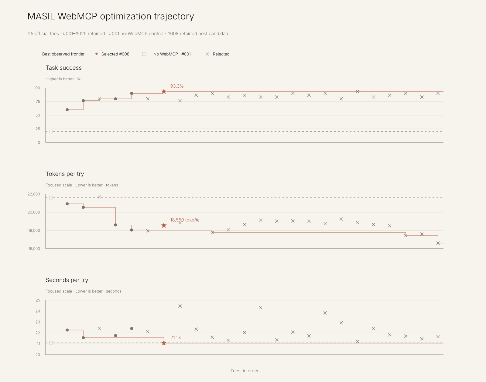

# Evaluation

> **Status: frozen through `iteration-025`. Within this retained range, `iteration-008` is the
> best accepted WebMCP candidate.**

MASIL evaluates whether WebMCP helps an Agent complete the creative activity the elder actually
wanted. A discovered tool, successful handler return, or visible animation is not sufficient on its
own.

## 1. Evaluation question

> Does an iterated WebMCP surface turn an elder's real request into a correct, visible, continuing
> creative activity more reliably than the same Agent working without WebMCP?

Success is boolean at the scenario level. A partial answer, approximate visual imitation, or tool
call without the required human-visible outcome remains a failure. The route—WebMCP or ordinary
browser operation—does not determine the score; the complete visible outcome does.

## 2. Controlled comparison

Every condition uses the same frozen tasks, assertions, Agent profile, repetition policy, and result
format.

1. **Without-WebMCP control** — the Agent may reason and use ordinary available capabilities but
   receives none of MASIL's semantic tools or provider-owned state.
2. **WebMCP candidates** — the Agent receives one version of MASIL's contract. Each candidate
   changes a bounded part of that contract, such as a tool description, schema, state result, or
   provider guard.
3. **Final retained candidate** — publishable only if it improves the frozen suite without weakening
   safety, recovery, or truthfulness assertions.

The control is not a deliberately weak chatbot prompt. It is the strongest fair attempt available
to the same Agent without MASIL's WebMCP surface.

## 3. What counts as success

### Calligraphy

The scenario passes only when all of the following are true:

- the Agent understands the requested Korean phrase and brush style;
- it creates a usable reference that matches both;
- the reference enters the live calligraphy canvas through WebMCP; and
- the elder's strokes remain intact as a separate human-authored layer.

A correct image left in chat, a predefined sample substituted for the request, or a successful tool
call with an unusable canvas result fails the scenario.

### Janggi

The scenario passes only when all of the following are true:

- the Agent resolves familiar, coordinate-free Korean against the actual position and turn;
- the selected move is legal under MASIL's complete rules engine;
- MASIL validates and visibly executes that exact move; and
- the match continues from the updated provider-owned board.

An explanation of the move, a coordinate guess, an illegal mutation, or a board animation that does
not become the next authoritative state fails the scenario.

### Cross-experience invariants

- A direct human action changes provider-owned state and the waiting Agent continues from that exact
  state rather than stale conversational context.
- Invalid, ambiguous, stale, malformed, or out-of-turn actions do not mutate authoritative state.
- Visible state, page revision, WebMCP result, and execution history agree.
- A scenario receives the same score for the same complete visible outcome regardless of whether
  the Agent used WebMCP or ordinary browser operation.

## 4. WebMCP surface iteration

1. Freeze realistic requests and assertion-based outcomes before running a candidate.
2. Run the without-WebMCP control and retain its full manifest.
3. Run one WebMCP candidate against the identical suite.
4. Classify each failure by the first broken link in the experience, not by model confidence.
5. Change one bounded part of the Agent-facing WebMCP surface.
6. Re-run the full frozen suite and retain the change only when verified task success improves.
7. Preserve failed and withheld cases; never lower the success definition to improve the result.

The WebMCP surface is treated as an Agent-facing product interface that can be evaluated and
improved—not as static plumbing assumed to work once a tool is callable.

## 5. Iteration and results record

The frozen suite contains 15 realistic requests with two independent clean-context repetitions:
30 sessions per iteration. `iteration-001` is the no-WebMCP control; `iteration-002` through
`iteration-025` are ordered WebMCP candidates. No later attempt is part of this evidence set.

<!-- accepted-benchmark:start -->
Latest accepted candidate iteration: **iteration-008** (20 tools; exact source preserved in [iteration-008/artifact](../evals/iterations/iteration-008/artifact/)).

| Configuration | Task success | Tokens / try | Seconds / try |
| --- | ---: | ---: | ---: |
| Candidate | 93.3% | 18,550 | 21.1 s |
| No WebMCP | 20.0% | 21,593 | 21.1 s |

### Official iteration record (001–025)

Each try links to its immutable manifest, benchmark, retained case grades, timing, final responses, and candidate code snapshot when WebMCP is present.

| Try | WebMCP tools | Decision | Task success | Tokens / try | Seconds / try |
| --- | ---: | --- | ---: | ---: | ---: |
| [#001](../evals/iterations/iteration-001/) | — | Control | 6/30 (20.0%) | 21,593 | 21.1 s |
| [#002](../evals/iterations/iteration-002/) | 20 | Accepted | 18/30 (60.0%) | 20,924 | 22.3 s |
| [#003](../evals/iterations/iteration-003/) | 20 | Accepted | 23/30 (76.7%) | 20,539 | 21.6 s |
| [#004](../evals/iterations/iteration-004/) | 20 | Rejected | 24/30 (80.0%) | 21,676 | 22.4 s |
| [#005](../evals/iterations/iteration-005/) | 20 | Accepted | 24/30 (80.0%) | 18,605 | 21.8 s |
| [#006](../evals/iterations/iteration-006/) | 20 | Accepted | 27/30 (90.0%) | 18,045 | 22.4 s |
| [#007](../evals/iterations/iteration-007/) | 20 | Rejected | 24/30 (80.0%) | 17,952 | 22.1 s |
| [#008](../evals/iterations/iteration-008/) | 20 | **Best accepted** | 28/30 (93.3%) | 18,550 | 21.1 s |
| [#009](../evals/iterations/iteration-009/) | 20 | Rejected | 23/30 (76.7%) | 18,854 | 24.5 s |
| [#010](../evals/iterations/iteration-010/) | 20 | Rejected | 26/30 (86.7%) | 19,218 | 22.3 s |
| [#011](../evals/iterations/iteration-011/) | 20 | Rejected | 27/30 (90.0%) | 17,772 | 21.6 s |
| [#012](../evals/iterations/iteration-012/) | 20 | Rejected | 25/30 (83.3%) | 18,059 | 21.3 s |
| [#013](../evals/iterations/iteration-013/) | 20 | Rejected | 26/30 (86.7%) | 18,630 | 22.0 s |
| [#014](../evals/iterations/iteration-014/) | 20 | Rejected | 25/30 (83.3%) | 19,137 | 24.3 s |
| [#015](../evals/iterations/iteration-015/) | 20 | Rejected | 25/30 (83.3%) | 19,019 | 21.4 s |
| [#016](../evals/iterations/iteration-016/) | 20 | Rejected | 27/30 (90.0%) | 19,052 | 22.1 s |
| [#017](../evals/iterations/iteration-017/) | 20 | Rejected | 26/30 (86.7%) | 19,000 | 21.7 s |
| [#018](../evals/iterations/iteration-018/) | 20 | Rejected | 27/30 (90.0%) | 18,748 | 23.8 s |
| [#019](../evals/iterations/iteration-019/) | 20 | Rejected | 24/30 (80.0%) | 19,251 | 22.9 s |
| [#020](../evals/iterations/iteration-020/) | 20 | Rejected | 28/30 (93.3%) | 18,900 | 21.2 s |
| [#021](../evals/iterations/iteration-021/) | 20 | Rejected | 25/30 (83.3%) | 18,658 | 22.4 s |
| [#022](../evals/iterations/iteration-022/) | 20 | Rejected | 26/30 (86.7%) | 18,507 | 21.8 s |
| [#023](../evals/iterations/iteration-023/) | 20 | Rejected | 27/30 (90.0%) | 17,429 | 21.7 s |
| [#024](../evals/iterations/iteration-024/) | 20 | Rejected | 25/30 (83.3%) | 17,608 | 21.5 s |
| [#025](../evals/iterations/iteration-025/) | 15 | Rejected | 27/30 (90.0%) | 16,612 | 21.7 s |
<!-- accepted-benchmark:end -->

## 6. Failures, withheld cases, and claim ceiling

Failures are retained under these categories:

- **Answer outside the activity:** the Agent explains or generates something, but it never becomes
  usable material in the live Web UI.
- **Intent mismatch:** the output reaches MASIL but does not match the requested phrase, style, or
  move.
- **Grounding failure:** the Agent ignores or misreads provider-owned state, turn, or legal actions.
- **Execution-only success:** a tool returns successfully without the required visible and
  continuing human outcome.
- **Continuity failure:** the page changes, but the waiting Agent continues from stale state.
- **Unsafe mutation:** an invalid, ambiguous, stale, or unconfirmed action changes authoritative
  state.
- **Evidence mismatch:** tool result, page revision, execution history, and visible outcome disagree.

This evaluation can support a claim about task completion under its exact Agent, tasks, and runtime.
It cannot establish accessibility for Korean elders, adoption, reduced isolation, institutional
value, or a social outcome. Those require direct target-user and field evidence.

## 7. Reproducible artifacts

| Artifact | What it proves | Evidence |
| --- | --- | --- |
| Frozen task set | The prompts and outcome assertions did not change between tries | [`evals/evals.json`](../evals/evals.json) |
| Ordered iteration record | Exactly 25 complete official iterations are retained | [`evals/iterations/`](../evals/iterations/) |
| Per-try evidence | Each try contains its manifest, benchmark, grading, timing, and final responses | Linked from every row above |
| Candidate source snapshots | Every WebMCP try preserves the exact evaluated provider code | Each candidate's `artifact/` directory |
| Final retained source | The accepted WebMCP implementation used by `iteration-008` | [`iteration-008/artifact/`](../evals/iterations/iteration-008/artifact/) |
| Machine-readable trajectory | The exact values used by the table and chart | [`trajectory.json`](../evals/optimization/trajectory.json) |
| Rendered trajectory | Task success, tokens, and time on one ordered visual | [`trajectory.svg`](../evals/optimization/trajectory.svg) |

Raw API responses remain local and ignored. Their hashes are preserved in the relevant manifests;
no API key, raw response, generated image payload, or personal data is part of the public evidence.

## 8. Results publication gate

The scoped benchmark is publishable only while all of the following remain true:

- the frozen manifest identifies the exact task set, configuration, and repetitions;
- the control and final candidate have complete artifacts under the same evaluation contract;
- task-level assertions, aggregate metrics, token use, and timing reconcile;
- the visible outcome and execution evidence agree; and
- limitations, failed cases, and withheld cases appear beside the improvement.

The retained artifacts satisfy this gate for the benchmark's narrow claim: task completion under
the recorded Agent, frozen requests, browser fixture, and runtime. They do not establish real-world
accessibility, adoption, reduced isolation, or institutional impact.
