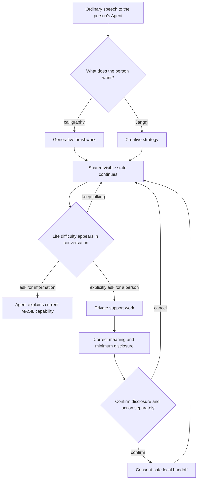

# Product definition

> **When the community center is out of reach and the web is impossible to
> navigate, where does creative life go?**

**MASIL reconnects digitally excluded older Koreans living alone with the
creative activities that once shaped their everyday lives—from calligraphy to
Janggi—through their own Agent and WebMCP.**

MASIL is an accessibility layer that lets a person who cannot operate the web
still shape a rich web experience through ordinary speech, direct touch, and
visible confirmation. The creative activity—not welfare intake—is the product's
primary value.

## Completed challenge scope

The challenge demo is a complete end-to-end implementation of its declared
scope. It includes calligraphy, Janggi, shared WebMCP state and execution
logging, and a consent-safe local handoff that can be reviewed, confirmed, read
back, and exited without external transmission. Partner-operated services and
measured real-world outcomes are separate expansion horizons described in
[Long-term vision](VISION.md).

## The person, not the category

The primary user is an older Korean adult who:

- lives alone or has no daily family support;
- is comfortable expressing intent in ordinary speech but not operating
  websites, nested menus, game controls, or administrative forms;
- can use a screen for visual feedback and direct confirmation;
- may find travel to a community or public-service center difficult; and
- still wants to make, imagine, choose, and take part in ordinary life.

“Older adult living alone” does not mean lonely, helpless, cognitively impaired,
or automatically at risk. “Digitally excluded” does not mean incapable of
learning. MASIL targets a structural mismatch between the person and the
interfaces available to them; it does not turn age or household type into a
deficit score.

One concrete target moment is:

> An older adult wants to write a holiday phrase or play Janggi, but a familiar
> community space is hard to reach and the web alternative demands unfamiliar
> menus and controls. During the activity they may mention an everyday
> difficulty. They do not yet know whether they want conversation, information,
> or help from another person.

The last sentence is not automatically a complaint, application, risk signal,
or consent to disclose anything.

## Product hierarchy

MASIL has one primary outcome and one secondary outcome.

### Primary — restore creative participation

The person can return to creative activity through the web without first
learning its controls. They remain the maker, player, and decision-maker. The
Agent contributes language understanding and generation; MASIL contributes the
live visual space, exact state, rules, permissions, and continuity.

### Secondary — preserve a path to human help

If the person explicitly asks, an approved part of the conversation can become
a small, correctable local handoff. The completed demo lets the person review,
confirm, read back, and leave that handoff without external transmission.
Professional assessment, exceptions, eligibility, and public authority remain
human responsibilities.

The secondary outcome cannot corrupt the primary one. Calligraphy and Janggi
must remain worthwhile even if the support window is never opened.

## One continuous product loop

The product is not three unrelated demos. One Agent relationship, one Orb, and
one shared session persist across the loop. Creative state is preserved when
support appears and when it closes.

## Creativity — from brushwork to strategy

Calligraphy and Janggi are not an arbitrary art-and-game bundle. Korea's 2025
senior-welfare guidance lists both among the hobby and cultural activities
offered through senior welfare centers. They are two grounded examples of the
creative and social life that can become unavailable when mobility, distance,
or the loss of a gathering place closes the physical route—and interface
literacy closes the digital route.

MASIL does not claim that the web replaces a community. It tests whether the
person can keep participating when both routes are otherwise closed.

### Generative calligraphy

The person names a character, phrase, occasion, or mood in their own words. It
need not exist in a menu.

Example:

> “추석을 한자로 써보고 싶어.”
>
> “I want to write *Chuseok* in Hanja.”

The Agent resolves the request to `秋夕`, generates one transparent reference
image containing the complete work, and shows it for the person's correction.
MASIL receives the text, image URL, and accessible description through WebMCP,
fits one to four characters on one screen, and places them in the live
calligraphy scene.

MASIL keeps the generated reference separate from the person's strokes, tracks
camera or fallback input, and preserves the exact place where the activity can
resume.

The person's strokes are never silently overwritten by the Agent. Camera access
requires a fresh person gesture after the reference appears; denial or failure
falls back to direct on-screen drawing.

Agent generation is necessary because the requested reference may not exist.
WebMCP is necessary because the generated object must enter the correct live
canvas, respect authorship boundaries, and remain available for the next turn.

### Conversational Janggi

The person says “장기 두자” without choosing a game mode, difficulty, board
orientation, or control scheme. MASIL opens the shared position and exposes its
exact state to the Agent.

MASIL owns the board orientation, piece identities, turn, move history, legal
destinations, rules, reset boundary, and visible move animation. The Agent does
not guess any of them from the screen.

The person can speak a move, tap a piece and a highlighted destination, or drag
the piece. Every path reaches the same rules engine and the same animated board.
A bounded WebMCP wait can resolve after one direct human move, allowing the same
Agent turn to read the new position and respond.

The Agent translates colloquial intent such as “왼쪽 차 위로 쭉,” answers
contextual questions, and selects a response. WebMCP lets it act on the exact
board rather than infer a game from pixels.

## Optional connection — support without surveillance

The activities create an ordinary reason to return and speak. They are not
sensors for hidden welfare intake.

MASIL must never infer a support request from:

- silence or absence;
- losing a game or making mistakes;
- handwriting or creative subject matter;
- camera movement;
- voice tone, emotion classification, or conversational sentiment; or
- how often the person uses the product.

If a difficulty appears, the Agent may ask:

> “Would you like me to keep listening, explain possible options, or help you
> prepare this for a person?”

No action is the default. Only an explicit choice opens a private support draft
containing the person's short statement, intended meaning, desired result,
recipient, and minimum approved disclosure.

The person can correct the draft in ordinary speech or on screen. Disclosure and
action are confirmed separately. The Agent cannot invent provider capacity or
convert conversation into an official application. The full flow is documented
in [Person-first service design](SERVICE-DESIGN.md).

## Product principles

1. **Value before extraction.** The person comes for creative activity, not to
   be assessed.
2. **Agency before automation.** Speech starts possibilities; the person owns
   corrections, disclosure, confirmation, cancellation, and recovery.
3. **One Agent, not a second companion.** The existing user Agent owns voice,
   reasoning, and private context. MASIL owns only provider state and visual
   projection.
4. **Visual state, not decorative UI.** Every transition must reveal or change
   meaningful provider state. The Orb is a legible presence signal, not a fake
   avatar.
5. **Provider truth, not model confidence.** Tools, state, rules, capacity, and
   failures come from MASIL. A model instruction is not an authorization
   boundary.
6. **Continuity over conversion.** A support interaction must return the person
   to the exact creative state they chose to leave.
7. **Cultural specificity without stereotyping.** Calligraphy and Janggi are
   grounded Korean examples, not claims that every older Korean enjoys the same
   activities.

## Actor and authority boundaries

| Actor | Owns | Must not own |
| --- | --- | --- |
| Older adult | Intent, creative choices, moves, corrections, disclosure, confirmation, cancellation | Administrative vocabulary, hidden workflow knowledge, or proof of digital skill |
| User-owned Agent | Voice, turn-taking, natural-language interpretation, private context, explanation, generation | Provider state, public eligibility, irreversible consent, or human judgment |
| MASIL page | Shared visual projection, activity state, state-valid WebMCP tools, person-visible confirmation | Raw audio, undisclosed conversation history, hidden risk scoring, or invented capacity |
| MASIL provider | Activity rules plus local-handoff revision, result, cancellation, and recovery | External government decisions, invented service capacity, or claims of institutional adoption |
| Human navigator | Human conversation, exceptions, preparation, and appropriate routing | Automatic inference outside their authority or unapproved disclosure |
| External public service | Official intake, assessment, eligibility, and decision | MASIL's internal state or product claims |

## Completed challenge outcome

The completed challenge journey is:

> A digitally excluded older adult creates and plays through ordinary speech;
> explicitly chooses to prepare one difficulty for a person; corrects and
> approves the exact meaning; receives a clearly labeled local handoff; and
> returns to the preserved activity.

The local handoff intentionally uses a fictional owner, time, next step, and
request identifier. It contacts no person, transmits no data, and creates no
government or external-service request. That visible boundary completes the
challenge story; real-world validation and provider integration are defined in
[Long-term vision](VISION.md).

## Non-goals

MASIL does not claim to:

- prevent solitary death or predict danger, loneliness, cognition, or health;
- replace emergency, medical, legal, welfare, or eligibility judgment;
- monitor inactivity, raw audio, full transcripts, or camera feeds for risk;
- file complaints or applications from ambient conversation;
- control the person through a guardian, institution, or family member;
- prove government adoption or measured staffing reduction;
- substitute an Agent for human relationships; or
- assume an external government or community-center website already provides
  WebMCP.

See [Evidence and Korean context](EVIDENCE.md) for the source ledger,
[Person-first service design](SERVICE-DESIGN.md) for the end-to-end workflow,
and [WebMCP design contract](WEBMCP.md) for the implementation boundary.
