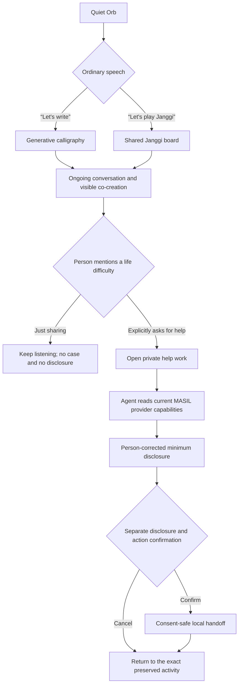

# MASIL service design

> **Status: complete challenge demo.** The finished journey includes
> calligraphy, Janggi, WebMCP projection and execution logging, and a reviewable
> local handoff whose consent and no-transmission boundary is visible.

## Product hierarchy

MASIL has one primary outcome and one secondary public outcome.

1. **Primary — reconnect creative life.** A digitally excluded older adult
   living alone should be able to return to creative activity through the web
   without first learning menus, modes, service vocabulary, or interaction
   conventions.
   WebMCP makes the provider's exact capabilities usable through the person's
   own Agent while the person keeps the visible result and final say.
2. **Secondary — preserve a path to human help.** If the person explicitly
   chooses to seek help, MASIL can turn only the approved part of the
   conversation into a correctable local handoff. It does not replace human
   assessment or public authority.

MASIL is therefore not a government intake form wrapped in an activity. The
activities must be worthwhile even if the help window is never opened.

## Where this document begins

The [README](../README.md) explains the main creative experience, and
[Product definition](PRODUCT.md) describes calligraphy and Janggi in detail.
This document focuses on the secondary path: what happens only when the person
explicitly asks MASIL to help prepare something for another human.

## The person-first journey

The activity is never treated as a risk sensor. A pause, mistake, losing a
game, camera motion, tone, or creative subject cannot open a support case.

## Verified public-service context

The government-side workflow is a secondary design constraint, not the hero
experience. The full claim-by-claim source ledger and its limits are kept in
[Evidence and Korean context](EVIDENCE.md).

The 2026 Korean customized care service for older adults
(`노인맞춤돌봄서비스`) includes safety checks, social participation,
daily-living education, daily-life support, specialized support, and resource
linkage. The
official sequence is application receipt by the local administrative welfare
center, selection survey and counseling by a commissioned local provider,
service-plan preparation, municipal decision, service delivery, reassessment,
termination, and follow-up. See the
[Ministry of Health and Welfare policy page](https://www.mohw.go.kr/menu.es?mid=a10712010400).

The official 2026 operating guide makes the human work more concrete:

- the local center finds potential recipients and receives applications;
- a dedicated social worker contacts the applicant, coordinates a home visit,
  performs the selection survey, and conducts the service counseling;
- counseling is face-to-face, requires listening, summarizing back, recording
  the person's words, resolving differences in understanding, and sometimes
  one or two additional visits;
- the social worker turns the result into service content, method, frequency,
  and a frontline care worker (`생활지원사`) assignment, then requests municipal
  approval;
- that frontline care worker provides the approved service, records delivery,
  monitors changes, and reports exceptions;
- one frontline care worker is planned around an average of 15 service users,
  subject to local adjustment; and
- reassessment can use service records plus phone or visit monitoring, while
  official eligibility, plans, and decisions remain human and institutional
  responsibilities.

Source: [2026 customized care service operating guide](https://www.1661-2129.or.kr/download/2026%EB%85%84%20%EB%85%B8%EC%9D%B8%EB%A7%9E%EC%B6%A4%EB%8F%8C%EB%B4%84%EC%84%9C%EB%B9%84%EC%8A%A4%20%EC%82%AC%EC%97%85%EC%95%88%EB%82%B4.pdf).

The wider local welfare-delivery system also assigns local centers initial
counseling, case discovery, integrated case management, resource linkage, and
follow-up. Complex cases move through needs assessment, case meetings,
selection, service planning, delivery, monitoring, closure, and follow-up. See
the [Ministry's current welfare-delivery overview](https://www.mohw.go.kr/menu.es?mid=a10708040100).

This evidence supports a narrow claim: a meaningful amount of necessary staff
time is spent hearing, clarifying, recording, routing, coordinating, notifying,
and monitoring. It does not prove a measured MASIL time saving.

## What the demo handles—and what remains human

| Person's difficulty | What the completed demo handles | What remains human or institutional |
| --- | --- | --- |
| The person does not know the right service name | The Agent turns ordinary language into a private, tentative summary | Staff decides whether any real service is appropriate |
| The story is difficult to repeat or correct | MASIL shows a short draft the person can revise before approving it | Professional listening and assessment remain human |
| The person is unsure what will be shared | MASIL separates disclosure confirmation from action confirmation | Any official record or disclosure requires a real authorized provider |
| A support story must remain coherent and recoverable | MASIL returns a clearly labeled local handoff, preserves its next step, and restores the activity | Eligibility, capacity, contact, and every official decision remain human or institutional |

MASIL does not automate eligibility, medical or emergency judgment, involuntary
risk scoring, official benefit decisions, mandatory reporting, or an in-person
survey required by an authorized service.

## Secondary support flow

### 1. Private listening

Ordinary activity conversation stays with the Agent host. MASIL receives no raw
audio, full transcript, or private Agent memory. The Agent can continue the
conversation or offer a choice:

> “Should I only keep listening, explain possible options, or help you prepare
> this for a person?”

No action is the default.

### 2. What MASIL can truthfully offer

Only after the person chooses help does MASIL expose the support operations
that are actually available. The completed demo can:

- open a private draft after an explicit request;
- prepare the minimum disclosure for the person's review;
- require separate disclosure and action confirmations;
- create and read a clearly labeled local handoff card; and
- return to the exact preserved creative activity.

MASIL never claims that an external government website already exposes
WebMCP. The challenge provider is MASIL and its bounded navigator workflow.

### 3. One shared support draft

The person and Agent edit a page-owned `support_work` containing only:

- the person's own short statement;
- the Agent's tentative interpretation;
- the result the person wants now;
- the intended recipient;
- the minimum approved facts;
- unanswered provider questions;
- the current revision and confirmation receipts;
- the provider status, owner, next step, and valid recovery actions.

The object excludes raw audio, the full activity conversation, hidden mood or
risk scores, unapproved identifiers, creative content, and Agent memory.

Operator responses, scheduling, and community-center integration are expansion
horizons described in [Long-term vision](VISION.md).

## Technical handoff

The exact tools, state rules, confirmations, and error behavior are documented
in [WebMCP design contract](WEBMCP.md). The service rule is simple: the Agent
may prepare only what the person explicitly requested, and the page must show
the same draft, revision, confirmation, and result that the provider accepts.

## Three-minute demo story

The demo should lead with the person's new digital capability, not with a
government dashboard.

| Time | Visible story | What the judge must understand |
| --- | --- | --- |
| 0:00–0:15 | Quiet Orb; the person says, “I want to write Chuseok in Hanja.” | No menu knowledge is required |
| 0:15–0:45 | Agent generates a reference; MASIL becomes a calligraphy space; the person draws | Agent generation enters a live WebMCP-owned activity |
| 0:45–1:15 | “Let's play Janggi instead.” MASIL preserves the work and becomes a real board; Agent and person exchange moves | One conversational interface can operate different rich web grammars |
| 1:15–1:40 | During play, the person says travel to the center is difficult and asks whom to contact | Ordinary life can remain ordinary conversation |
| 1:40–1:55 | Agent asks whether to keep listening or prepare the issue for a person; the person chooses preparation | No hidden intake or surveillance |
| 1:55–2:20 | MASIL shows one concise support object; the person corrects “cleaning” to “grocery accompaniment” and approves the exact disclosure | The person, not the Agent, owns meaning and disclosure |
| 2:20–2:40 | MASIL creates a clearly labeled local handoff card and shows that no external institution was contacted | The boundary is intentional, visible, and person-controlled |
| 2:40–3:00 | Agent reads the local status and MASIL returns to the exact Janggi position | Recovery and preserved creative continuity |

## Challenge product boundary

The completed challenge demo demonstrates:

- two visible activities only: calligraphy and Janggi;
- voice owned by the Agent host and visual state owned by MASIL;
- a real, inspectable Janggi position, legal-move engine, and move history;
- a generated arbitrary calligraphy reference kept separate from human strokes;
- one explicit transition from an activity to private support work;
- one person correction that changes the provider payload and valid action;
- a consent-safe local MASIL handoff, clearly distinguished from a real provider
  queue;
- exact status readback and return to the preserved activity; and
- no external transmission, government submission, automatic risk detection,
  or official decision.

The next step beyond this completed boundary is described in
[Long-term vision](VISION.md).
