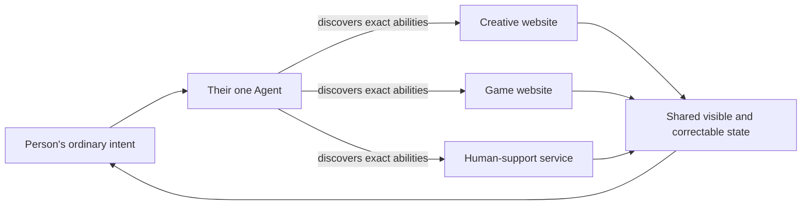

# Long-term vision

## North star

> **When the community center is out of reach and the web is impossible to
> navigate, where does creative life go?**

> **MASIL reconnects digitally excluded older Koreans living alone with the
> creative activities that once shaped their everyday lives—from calligraphy
> to Janggi—through their own Agent and WebMCP.**

MASIL opens a new frontier for web accessibility: success is not only whether
a person can operate an interface, but whether they can achieve and control a
meaningful outcome without first learning it. WebMCP makes the provider's exact
capabilities, state, permissions, and recovery usable through the person's own
Agent while the person keeps intent, authorship, confirmation, and control.

Older Koreans living alone are the first, most concrete audience. Calligraphy
and Janggi are the first two activities. The larger invention is an
agent-mediated accessibility layer for people whom the human-operated web has
left outside.

## Each site explains what the Agent can do

Traditional accessibility improves a human interface. That work remains
essential, but it still asks a person to learn each new site's structure.

MASIL adds another layer:

The person does not memorize three interfaces. Their Agent carries language and
private context; each site supplies its real capabilities, state, and limits.
The person sees the result in the site's visual medium and can interrupt,
correct, or reverse it.

The expansion logic is therefore not “add more chatbot skills.” It is:

> **Let more trustworthy websites become usable through the same person-owned
> Agent relationship.**

## Why the first experience begins with culture

Many technologies for older adults begin with monitoring, medication,
emergency response, or administrative access. Those can be valuable, but they
position the person as a risk or service recipient before they have received
anything they chose.

MASIL begins with creativity—from brushwork to strategy—because:

- they have intrinsic value even when no support need appears;
- they make the person a maker and player rather than a monitored subject;
- they expose WebMCP's shared-state advantage immediately;
- they create a natural, recurring context for conversation; and
- they allow the optional human-support path to appear without becoming a
  hidden intake funnel.

This ordering is product architecture, not just storytelling.

## Horizon 0 — completed challenge demo

**Result:** a complete demonstration of the interaction inversion in one
coherent experience.

The completed challenge build demonstrates:

- one user-owned Agent handling voice, intent, reasoning, and generation;
- a MASIL-owned Orb and visual space;
- arbitrary one-to-four-character calligraphy generated into a live canvas;
- a real Janggi position whose rules and legal actions are exposed semantically;
- both speech-led and direct human manipulation reaching the same provider
  state;
- a bounded asynchronous human turn that the Agent can answer;
- one explicitly opened, person-corrected support object;
- separate disclosure and action confirmation;
- one local-only demo result and return to preserved creative state; and
- an inspectable WebMCP execution log connecting intent, tool, state, and visual
  result.

**What this proves:** a person can shape multiple rich web experiences without
learning their controls, and WebMCP can preserve exact provider truth and human
control across the journey.

## Horizon 1 — one bounded community pilot

**Goal:** test whether the interaction works for the intended people before
expanding the feature set.

This horizon validates target-user usability, social outcomes, provider
efficiency, persistence, and partner integration as the next stage after the
completed challenge experience.

A credible first pilot would have:

- one local cultural or senior-support partner;
- a small invited cohort of digitally excluded older adults living alone;
- observed accessibility sessions and interviews with participants and partner
  staff;
- calligraphy and Janggi only;
- one human navigator queue owned by the pilot provider, not an external
  government system;
- ordinary-language consent, cancellation, and deletion;
- a baseline for repeated explanation, missing-information, scheduling, and
  status work;
- no ambient monitoring, risk prediction, or emergency positioning; and
- an accessible fallback for every camera or gesture interaction.

The pilot should measure capability, not novelty reactions:

- Can the person begin without menu instruction?
- Can they request something that was not pre-authored?
- Can they understand what the Agent changed on the page?
- Can they correct a phrase or move?
- Can they distinguish private conversation from disclosed support work?
- Can they cancel and return to the exact activity state?
- How much staff clarification remains before a first human conversation?

It should also test whether MASIL produces:

- completion of a creative session without menu or form navigation;
- successful correction, cancellation, and return to preserved state;
- clear understanding of what stays private and what is disclosed;
- fewer repeated explanations and missing-information follow-ups; and
- a more auditable record of person corrections and confirmations.

Failure on those questions should narrow or redesign the product before any
institutional expansion.

## Horizon 2 — a local partner network

**Goal:** connect multiple bounded community capabilities without making the
Agent invent availability or authority.

Potential partner capabilities could include:

- additional culturally relevant creative activities;
- facilitated remote clubs or classes;
- a human navigator or phone-companion preparation service;
- current local-program availability;
- visit or call scheduling owned by a participating provider; and
- person-readable status and recovery.

Every participating service would have to publish:

- what it can and cannot do;
- the exact state and revision;
- required inputs and prohibited data;
- which actions require a fresh person confirmation;
- current capacity and unavailable reasons;
- responsible owner and next expected time; and
- cancellation, correction, expiry, and recovery paths.

The external community center or government website is never assumed to expose
WebMCP. MASIL can only represent the capabilities and authority of a provider
that has actually joined the workflow.

## Horizon 3 — an agent-native accessibility layer for the open web

**Goal:** make interface literacy less predictive of who can participate.

The broader future is not one giant MASIL application. It is an open pattern in
which web providers expose semantic capabilities to user-owned Agents while
maintaining a shared human-visible state.

That pattern can extend beyond older adults and beyond Korean culture. Its
essential properties remain:

1. the Agent carries the person's language and private context;
2. the provider carries domain truth, live state, permissions, and recovery;
3. WebMCP joins them at a visible, stateful web surface;
4. the person remains the author and decision-maker; and
5. consequential actions require explicit, comprehensible confirmation.

MASIL's contribution is to prove the pattern with an audience for whom the
current web's assumptions fail visibly and consequentially.

## What should scale—and what must not

### What can scale

- the number of trustworthy website capabilities an Agent can discover;
- continuity across activities and support states;
- the person's ability to express intent without provider vocabulary;
- clearer valid actions and missing information for participating services;
- reusable confirmation, correction, and recovery contracts; and
- evidence that a person completed the outcome without proxy operation.

### What must never scale silently

- raw conversation archives;
- inferred mood, cognition, health, loneliness, or risk profiles;
- creative-content surveillance;
- cross-provider identity graphs;
- family or institutional control over the person's choices;
- automatic public-service submissions; or
- claims that engagement frequency is a safety signal.

Scaling access without scaling surveillance is a hard product requirement.

## Adoption prerequisites

Any real-world expansion beyond the completed challenge experience requires:

- target-user research and accessibility testing;
- a real provider with bounded authority and accountable human ownership;
- authentication appropriate to the provider action;
- data minimization, retention, deletion, and incident procedures;
- auditable consent and confirmation records expressed in ordinary language;
- security and abuse testing of WebMCP tools and image transport;
- a fallback and escalation policy that does not imitate emergency or medical
  services; and
- prospective measurement with explicit failure thresholds.

## When MASIL should stop expanding

MASIL should not expand if research shows that:

- the target person still needs an expert to begin or recover;
- provider tools do not materially reduce interface learning;
- visible state does not improve comprehension or correction;
- a strong fixed accessible UI produces the same capability more safely;
- the support path makes creative participation feel monitored;
- staff receive work that is less accurate or more burdensome than existing
  contact; or
- consent and cancellation cannot be made genuinely comprehensible.

The vision is ambitious because it changes who must understand the interface.
It remains credible only if the person gains capability without losing privacy,
agency, or access to real human judgment.
