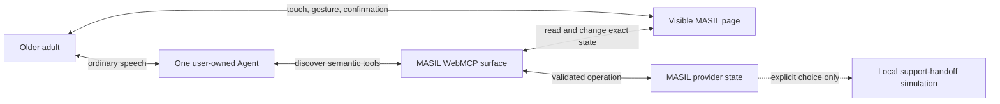

# WebMCP design contract

## The accessibility role

> **A person should be able to use the web before they know how to operate its
> interface.**

MASIL uses WebMCP as an agent-mediated accessibility layer. The person states
an intention in ordinary language. Their own Agent understands that intention.
MASIL then exposes the page's exact capabilities, live state, rules,
permissions, confirmation boundaries, and recovery paths to that Agent.

The result remains in the real page where the person can see it, change it,
confirm it, or stop it. WebMCP therefore does more than help an Agent click a
website: it makes a rich web experience usable without making interface
literacy the price of entry.

This does not replace conventional web accessibility. Perceivable, operable,
understandable human interfaces remain essential. MASIL adds a second test:

> **Can the person achieve and control a meaningful outcome without first
> learning that interface?**

The external community center or government service is not assumed to expose
WebMCP. MASIL is the WebMCP provider in the challenge build.

## One Agent and one visible surface

The user-owned Agent owns conversation, microphone input, spoken output,
turn-taking, interruption, reasoning, generation, and private context. MASIL
does not embed a second Agent, model, Realtime client, API key, browser STT, or
browser TTS.

The host may call `masil_project_agent_presence` with `ready`, `listening`,
`receiving`, `creating`, `speaking`, `awaiting`, or `connected`, plus an
optional short person-visible caption. MASIL projects that coarse phase into
the Orb and current scene. It never receives raw audio, full transcripts,
token deltas, private Agent memory, or inferred emotion or risk.

The runtime loop is fixed:

1. the person speaks or types to their existing Agent;
2. that same Agent discovers and invokes MASIL's WebMCP tools;
3. MASIL validates provider state and visibly applies the operation;
4. MASIL returns a structured result; and
5. the same Agent continues the conversation.

If the host cannot publish a real listening or speaking phase, MASIL shows only
the operation phases it can verify. It does not fabricate a live voice state.

## Challenge demo tool catalog

MASIL registers one stable catalog with
`document.modelContext.registerTool()`. Read results expose the current scene
revision and state-valid next actions; write handlers enforce their page-owned
preconditions.

| Tool | Role in the shared experience |
| --- | --- |
| `masil_get_capabilities` | Explains the available activities, asset contract, interaction boundaries, and single-Agent architecture |
| `masil_get_session_state` | Returns the exact visible scene, revision, preserved state, and `validNextActions` |
| `masil_project_agent_presence` | Projects a coarse, non-audio Agent phase into the Orb and caption |
| `masil_open_activity` | Opens calligraphy or Janggi after the person expresses that intent |
| `masil_set_calligraphy_reference` | Places an Agent-generated one-to-four-character reference image without changing human strokes |
| `masil_get_janggi_state` | Returns the complete live position, turn owner, coordinate convention, and legal destinations |
| `masil_wait_for_person_janggi_move` | Waits up to 45 seconds inside one active Agent turn for one direct human board move |
| `masil_move_janggi_piece` | Previews, validates, and visibly animates one semantic person or Agent move |
| `masil_open_support_note` | Opens a private, no-action note only after an explicit request for help |
| `masil_prepare_support_review` | Prepares the minimum disclosure and local-demo recipient for visible review |
| `masil_create_local_handoff` | Creates an in-memory demo card after two confirmations at the visible revision |
| `masil_get_handoff_status` | Reads the local demo owner, status, callback time, and next step |
| `masil_return_to_activity` | Restores the preserved calligraphy or Janggi scene without deleting the handoff result |

Tool discovery is not authorization. A discoverable tool still fails if its
required scene, turn, explicit intent, confirmation, or revision is absent.
The catalog stays stable to avoid registration races; `validNextActions`
describes what is currently usable.

`masil_get_capabilities`, `masil_get_session_state`, and
`masil_project_agent_presence` are available in every scene. The remaining
state-valid surface is:

| Scene | Additional valid tools | Page-owned boundary |
| --- | --- | --- |
| `home` | `masil_open_activity` | The Agent opens only the activity the person requested |
| `activity / calligraphy` | `masil_set_calligraphy_reference`, `masil_open_support_note` | An Agent may replace only the reference layer; camera access still needs a fresh person gesture |
| `activity / janggi` | `masil_get_janggi_state`, `masil_move_janggi_piece`, `masil_wait_for_person_janggi_move` on the person's turn, `masil_open_support_note` | The provider—not the model—owns turn order, legal moves, rules, and animation completion |
| `private` | `masil_prepare_support_review`, `masil_return_to_activity` | The note is private and creates no request |
| `review` | `masil_return_to_activity`; `masil_create_local_handoff` only after both confirmations | Disclosure and action are confirmed separately at one visible revision |
| `handoff` | `masil_get_handoff_status`, `masil_return_to_activity` | The result is local and in-memory; no institution or government system is contacted |

## Agent-generated calligraphy contract

The personal Agent—not MASIL—generates a requested raster reference. A person
may choose a visible suggestion or name any other one-to-four-character Korean
or Hanja phrase in conversation. For an arbitrary request, the Agent creates
one complete image and calls `masil_set_calligraphy_reference` with the exact
text, a page-readable `referenceImageUrl`, and accessible alt text.

The image contract travels in the WebMCP tool description and parameter
schema:

- render the complete one-to-four-character phrase in one image;
- use solid black Korean or Hanja brush-calligraphy strokes;
- use a real transparent alpha channel, preferably PNG;
- include safe outer margins so the entire phrase fits on one screen; and
- include no paper, checkerboard, seal, signature, decoration, translation, or
  extra text.

The URL may be an image data URL, a same-origin MASIL URL, or an HTTPS URL
readable by the page. Local filesystem paths and Agent-context `blob:` URLs are
rejected because the page cannot resolve them. MASIL fits the full image with
`object-fit: contain` and keeps it in an Agent-authored reference layer. The
WebGPU human-stroke layer remains separate and preserved.

Receiving an image is not camera consent. Camera access begins only after a
fresh click on MASIL's visible air-writing control. Denial or camera failure
falls back to direct on-screen drawing.

## Human–Agent Janggi turn contract

Speech and direct manipulation reach the same position and rules engine:

1. The Agent reads `masil_get_janggi_state`; it does not infer the board from
   pixels.
2. For a spoken Cho move, the Agent resolves the person's phrase to a stable
   piece ID and legal destination, then calls `masil_move_janggi_piece` with
   `actor: person` and `personConfirmed: true`.
3. For a direct move, the person taps or drags a piece to one of the displayed
   legal destinations while `masil_wait_for_person_janggi_move` is pending.
4. The provider validates the move and completes the same vGPU move and camera
   animation before either call resolves.
5. A completed person move returns `shouldAgentReply: true`. The same user
   Agent chooses a legal Han response and calls `masil_move_janggi_piece` with
   `actor: agent`.
6. The Agent move resolves after its animation with
   `awaitingPersonSpeech: true`. The next utterance starts a new Agent turn.

The 45-second gesture wait is bounded to one active Agent turn. It cannot wake
an idle Agent and must never remain open while waiting for future speech.

MASIL is the rules authority. It validates turn ownership, horse and elephant
blocks, palace lines, cannon screens and restrictions, captures, check,
checkmate, bikjang, and pass eligibility before changing the shared board.

## Shared provider objects

### `activity_work`

Contains the activity, scene revision, Agent reference layer, human-created
stroke layer, preserved board or canvas state, and resume point. The Agent
cannot modify human strokes unless the person explicitly targets them.

### `support_handoff_work`

Contains only the current revision, tentative meaning, desired result, minimum
disclosure, person corrections, two confirmations, local-demo recipient, and
local-demo result.

It must not contain raw audio, full transcripts, camera frames, private Agent
memory, unapproved addresses or financial details, or inferred health,
emotion, loneliness, or risk scores.

### `agent_projection`

Contains only the current visual phase and an optional short caption. It is
transient projection state, not a conversation record.

## Support, confirmation, and recovery

A mention of pain, loneliness, missed delivery, silence, error, or unusual
activity is not a support request. `masil_open_support_note` requires
`personExplicitlyAsked: true`. Opening the note creates no provider payload and
transmits nothing.

Two different visible human decisions are required before the local handoff:

1. **Disclosure confirmation:** this exact information may be shown to this
   recipient.
2. **Action confirmation:** create this exact handoff now.

Changing the disclosure invalidates the prior confirmation.
`masil_create_local_handoff` also requires the exact revision the person saw; a
mismatch returns `STALE_REVISION`.

The completed handoff is deliberately recoverable and explicit: it returns
`localDemoOnly: true`, `externalTransmissionOccurred: false`, and
`governmentRequestCreated: false`. The person can return to the preserved
creative activity at any point.

## Completed challenge demo boundary

The completed local challenge build includes:

- imperative WebMCP site-tool registration and a stable 13-tool catalog;
- state-valid action readback and typed guard failures;
- an inspectable execution log tying invocation to visible state change;
- arbitrary one-to-four-character Agent-generated calligraphy references;
- separate Agent reference and human stroke layers;
- camera-first air writing with a fresh human-gesture boundary;
- a complete Janggi rules state exposed semantically;
- spoken, tapped, and dragged moves using the same provider rules and
  animation;
- a bounded direct-human-move wait and same-turn Agent response contract;
- a private support note, separate disclosure and action confirmations, stale
  revision rejection, local-only handoff, status readback, and return to the
  preserved activity; and
- no page-owned model, speech API, hidden Agent, or external transmission.

The local handoff is the intentional, completed endpoint of the challenge
experience. Its no-transmission result is visible in both provider state and
the execution log. Identity, persistence, a staffed queue, partner integration,
and measured outcomes are separate expansion horizons in
[Long-term vision](VISION.md).

## Why alternatives do not close the loop

| Alternative | First missing edge |
| --- | --- |
| Generic voice conversation | It can understand speech but does not own MASIL's live canvas, board, legal actions, authorship, or provider result |
| Strong fixed accessible UI | It still makes each person learn the activity's controls and translate ordinary intent into predefined interaction grammar |
| Computer Use | It must infer state, pieces, permissions, and confirmations from pixels and a human-facing UI that may change |
| Backend MCP | It can perform structured operations while bypassing the person-visible page where authorship, corrections, consent, and recovery are shared |
| Human-only intake | It preserves judgment but requires synchronous staff effort for every first explanation, reformulation, routing, and status check |
| **MASIL with WebMCP** | The person's Agent receives exact provider truth while the person retains a visible, correctable, interruptible result |

If “just ask the Agent” or a predetermined accessible interface can produce the
same starting intent, visible co-creation, provider-valid result, human control,
and recovery, MASIL should not claim WebMCP necessity.

## Completed-demo invariants

The completed challenge experience is defined by these deterministic
invariants:

- `validNextActions` and handler guards agree in every scene;
- invalid, stale, out-of-turn, blocked, or malformed calls return recoverable
  errors;
- calligraphy URL validation preserves human strokes and the camera boundary;
- direct and Agent-led Janggi moves reach identical provider states;
- the bounded human wait resolves only after the visible move animation or a
  timeout/cancellation;
- disclosure edits invalidate prior confirmation;
- local handoff cannot execute without both confirmations and the seen
  revision;
- tool results and the visible execution log agree; and
- no raw audio, transcript, camera frame, or private Agent memory enters a
  provider payload.

The corresponding Agent behavior expectations are:

- direct creative requests select the correct tool and arguments;
- arbitrary calligraphy text produces one correctly isolated, fitted reference;
- natural-language Janggi requests are grounded in the current legal-move
  result rather than guessed;
- ambiguous inconvenience or distress does not open or submit help;
- the Agent distinguishes disclosure confirmation from action confirmation;
- the Agent does not automatically retry a stale consequential write; and
- the Agent returns to the preserved activity after completion or cancellation.

### Submission evidence

The final recording should show the registered tool list, exact arguments,
revision change, visible side effect, structured result, and recovery path in
one coherent WebMCP-capable session. It should include an arbitrary calligraphy
reference, a person move and Agent reply on the same Janggi board, and the
local-only support result. A narrated mock or static UI does not satisfy this
contract.
